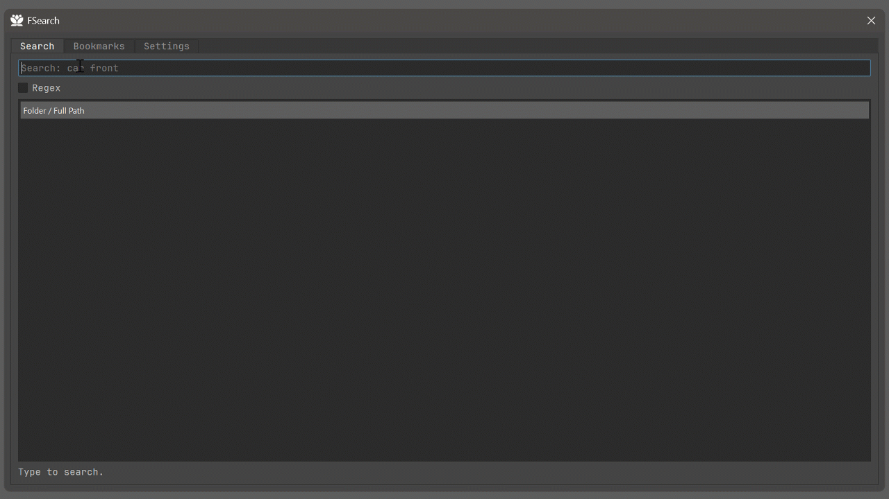
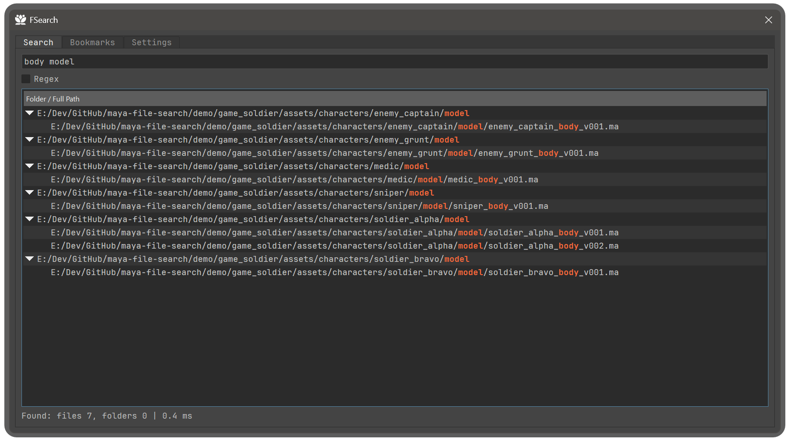
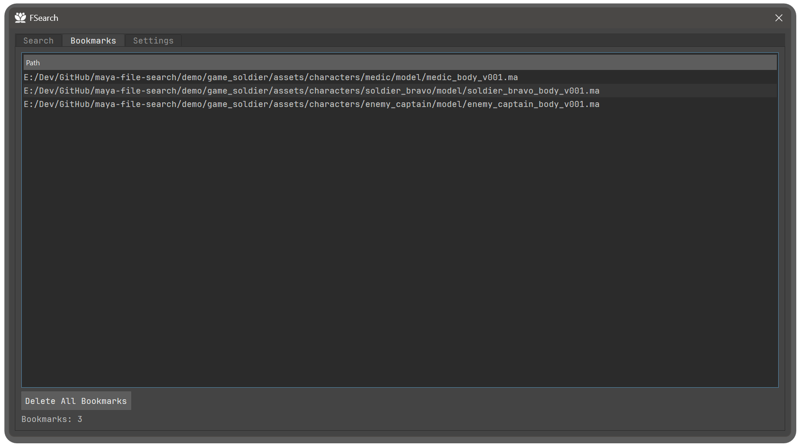
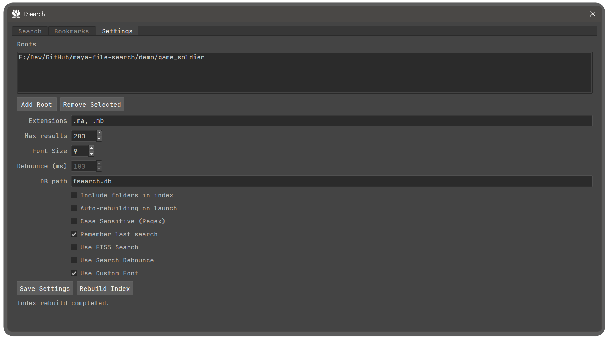

# FSearch for Maya

Fast indexed file search UI for Autodesk Maya.

`fsearch-maya` builds a local SQLite index for your project roots and gives you instant search, bookmarks, and one-click open for `.ma/.mb` scenes.



## Why This Exists

Maya's default **Open** dialog is fine for browsing, but it gets slow and awkward on large production trees.

This tool is optimized for daily work with deep folders and many scene files:
- Indexed search across one or multiple roots
- Partial and token-based matching
- Bookmarks for frequently used files/folders
- Fast reopen and reveal actions from a single UI

## Key Features

### Search tab
- Hybrid search pipeline:
  - `FTS5` first (when enabled)
  - `LIKE` fallback for partial/incomplete input coverage
- Two search interaction modes:
  - `Live Search` (default): search while typing
  - Manual mode: result updates only on `Search` button or `Enter`
- Optional regex mode
- Optional search debounce with configurable milliseconds
- Result list grouped by folder
- Double-click opens Maya scene files (`.ma`, `.mb`)
- Context actions:
  - Open file (Maya files only)
  - Copy path
  - Open containing folder
  - Create bookmark
- Search status line with found counts and timing
- When FTS5 is enabled, status also shows FTS contribution percentage



### Bookmarks tab
- Stores file and folder bookmarks
- Multi-selection supported
- `Del` key removes selected bookmarks
- Context actions:
  - Open containing folder
  - Open in Maya (single selection, Maya files only)
  - Remove bookmark
- `Delete All Bookmarks` button
- Bookmarks persist in config between sessions



### Settings tab
- Manage indexing roots
- Extensions filter
- Max results
- Include folders in index
- Auto-rebuilding on launch
- Regex case-sensitive option
- Remember last search
- Live Search toggle (live/manual mode)
- Enable/disable FTS5 search
- Enable/disable debounce + debounce ms
- Enable/disable custom font + font size
- DB path
- Save settings / rebuild index
- Non-blocking async rebuild (UI remains responsive)
- Global "indexing in progress" status visible across tabs



## Persistence

Settings are stored in:
- `src/.data/config.json`

This includes roots, search behavior (including Live Search mode), bookmarks, window size, font options, FTS toggle, debounce options, and other UI preferences.

## Project Structure

- `src/fsearch.py` - facade/service used by UI
- `src/fsearch_index.py` - SQLite schema, indexing, search logic
- `src/fsearch_config.py` - config load/save/update
- `src/fsearch_maya_ui.py` - Qt UI for Maya
- `src/fsearch_ui_common.py` - shared UI constants/delegates/styles

## Run in Maya

Because code lives under `src`, add it to `sys.path` first:

```python
import sys

project_src = r"E:\Dev\GitHub\fsearch-maya\src"
if project_src not in sys.path:
    sys.path.append(project_src)

import fsearch_maya_ui
fsearch_maya_ui.show_file_searcher_ui()
```

## Hot Reload During Development

In Maya Script Editor:

```python
import sys
import importlib

project_src = r"E:\Dev\GitHub\fsearch-maya\src"
if project_src not in sys.path:
    sys.path.append(project_src)

for name in [
    "fsearch_ui_common",
    "fsearch_config",
    "fsearch_index",
    "fsearch",
    "fsearch_maya_ui",
]:
    if name in sys.modules:
        importlib.reload(sys.modules[name])
    else:
        __import__(name)

import fsearch_maya_ui
fsearch_maya_ui.show_file_searcher_ui()
```

## Why It Beats Maya Open Dialog (for production-sized trees)

- **Speed on repeated usage**: index once, search quickly many times.
- **Better query behavior**: token-based and partial matching in one UX.
- **Less navigation overhead**: no repetitive manual folder drilling.
- **Bookmark workflow**: keep frequent scenes/folders one click away.
- **Search-first pipeline**: optimized for "I know part of the name/path" workflows.
- **Persistent UX**: remembers key settings and restores working context.

## Notes

- "Open in Maya" is intentionally available only for `.ma/.mb` files.
- If FTS5 is disabled in settings, search uses LIKE-only mode.
- If Live Search is disabled, use the `Search` button or press `Enter` in the query field.
- Indexing behavior depends on selected roots and extension filters.
